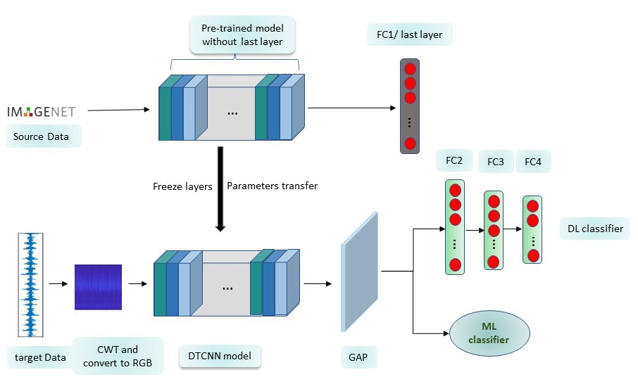
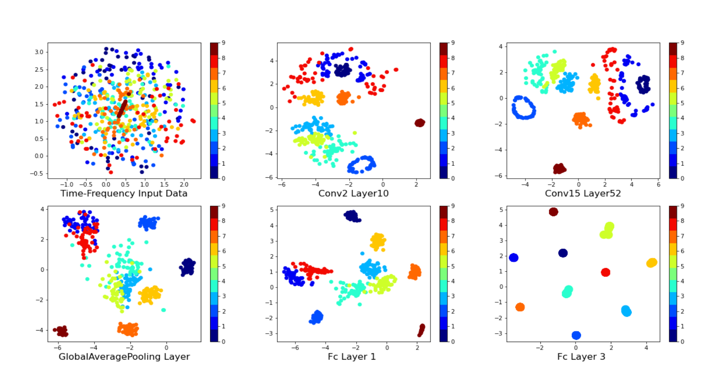
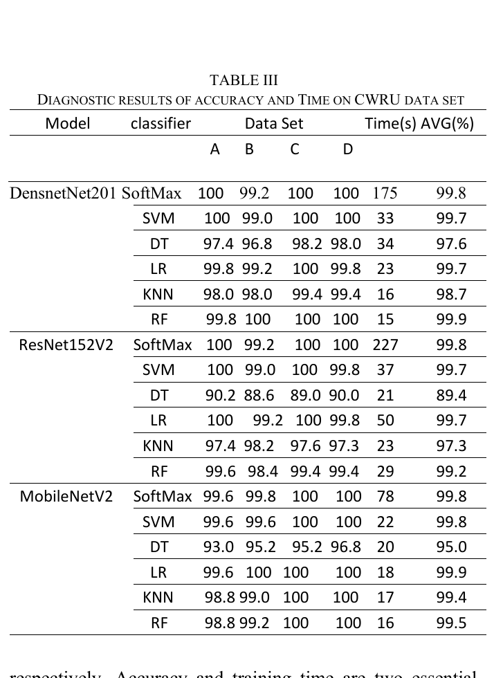

# Intelligent Fault Diagnosis of Rolling Bearing Based on Deep Transfer Learning Using Time-Frequency Representation

> Official implementation of the IEEE ICSPIS 2021 paper.

> **DTCNN** — a deep transfer-learning framework that turns 1-D bearing vibration signals into time–frequency RGB images via continuous wavelet transform, extracts high-level features with ImageNet-pretrained CNNs (DenseNet201 / ResNet152V2 / MobileNetV2), and classifies faults with ML/DL classifiers — accurate even with limited labeled data.

<p align="left">
  <a href="https://doi.org/10.1109/ICSPIS54653.2021.9729385"></a>
  <a href="https://ieeexplore.ieee.org/document/9729385"></a>
  
  
  
</p>

**Authors:** [Mohammadreza Kavianpour](https://github.com/kavianpour)¹, Mohammadreza Ghorvei¹, Amin Ramezani¹ \*, Mohammad T. H. Beheshti¹

¹ Department of Electrical and Computer Engineering, *Tarbiat Modares University*, Tehran, Iran
\* Corresponding author

Published in the **2021 7th International Conference on Signal Processing and Intelligent Systems (ICSPIS)**, IEEE.
DOI: [10.1109/ICSPIS54653.2021.9729385](https://doi.org/10.1109/ICSPIS54653.2021.9729385)

---

## TL;DR

Deep CNNs need lots of labeled data, but bearing-fault data is costly and slow to collect, so fault-diagnosis CNNs stay shallow and underperform. **DTCNN** sidesteps this by transferring ImageNet-pretrained networks: vibration signals are converted to time–frequency RGB images with continuous wavelet transform (CWT), a frozen pretrained CNN extracts high-level features, and ML or DL classifiers diagnose the fault. On the CWRU benchmark it reaches up to **99.95 %** accuracy with much lower training time than training a deep CNN from scratch.

The three core ideas:

1. **Transfer learning beats data scarcity.** Frozen ImageNet-pretrained CNNs (DenseNet201, ResNet152V2, MobileNetV2) provide deep feature extractors without needing massive labeled fault data.
2. **Time–frequency input.** CWT converts each 1-D signal into a 2-D RGB image carrying both time and frequency information — the right input shape for image CNNs.
3. **Feature extractor + flexible classifier.** Pretrained features feed six classifiers (SoftMax/FC plus SVM, LR, RF, KNN, DT), giving accuracy with low training time.

> [!NOTE]
> **Documentation & resources only.** This repository currently contains **documentation, the dataset description, and figures extracted from the paper** — a curated showcase of the published work. The training/inference source code is **not yet public** (see the [Roadmap](#roadmap)). If you need details beyond what is documented here, please reach out or cite the paper.

---

## The framework / architecture

A raw 1-D vibration signal is converted by **CWT** into a time–frequency image, resized to 224×224, normalized to [0,1], and turned into RGB. This image enters one of three **pretrained DTCNN** backbones (DenseNet201, ResNet152V2, MobileNetV2) with their last layer removed and remaining layers frozen. The extracted features pass through a **global average pooling (GAP)** layer, then to classifiers: a DL head (three FC layers + SoftMax) or one of five ML classifiers (SVM, LR, RF, KNN, DT).



*Structure of the proposed DTCNN method (Fig. 1 in the paper): ImageNet source → frozen pretrained backbone (parameter transfer) → CWT-RGB target input → GAP → ML/DL classifier.* © 2021 IEEE — see [LICENSE](LICENSE).

Full pipeline details, the transfer-learning and CWT formulation, and the training setup are in [`docs/method.md`](docs/method.md).

---

## Why this is hard

| Challenge | Why it breaks ordinary models | How DTCNN responds |
|---|---|---|
| **Labeled fault data is scarce** | Changing a bearing from healthy to faulty and gathering faulty data is slow and costly; deep CNNs overfit without enough data. | Transfers ImageNet-pretrained networks, so deep feature extractors work without massive labeled fault data. |
| **Deep CNNs are expensive to train** | Hundreds of layers from scratch need huge data and long training. | Freezes pretrained parameters; only a light classifier is trained → much lower training time. |
| **Hand-crafted features need expertise** | Classical ML requires appropriate manual feature extraction, limiting generalization. | Pretrained CNN features replace manual feature engineering. |
| **1-D signal vs 2-D CNN input** | Image CNNs expect 2-D input; raw vibration is 1-D and lacks joint time–frequency info. | CWT converts the signal to a 2-D time–frequency RGB image with both time and frequency content. |
| **Choosing the wavelet basis** | A poor wavelet basis yields weak time–frequency features. | Selects the wavelet by Energy-to-Shannon entropy ratio (Morlet wins on CWRU). |

---

## Two key ideas

**1. Parameter transfer.** Knowledge (in the form of parameters) learned by a model trained on a large source domain (ImageNet) is reused on the target task. The last layer is removed and the remaining layers frozen, so the pretrained backbone acts as a fixed deep feature extractor — avoiding the data and time costs of training a deep CNN from scratch.

**2. CWT time–frequency representation.** Continuous wavelet transform converts the 1-D vibration signal into a 2-D time–frequency image, capturing non-stationary, nonlinear characteristics and both time and frequency information simultaneously — a far richer input for image CNNs than raw time-domain data. The wavelet basis is chosen by the Energy-to-Shannon entropy ratio.

The t-SNE visualization shows features becoming progressively more separable from the input through to the FC layers, confirming the pretrained backbone produces discriminative features:



*t-SNE of features across six layers for the ten CWRU conditions in the "DenseNet201+FC" model (Fig. 2 in the paper).* © 2021 IEEE.

---

## Headline results

The CWRU benchmark has four load conditions (datasets A–D) and ten classes (nine faults + normal). Each model–classifier pair was run 10 times. Below are the per-model mean accuracies and training times (Table III in the paper):



*Diagnostic accuracy (%) per dataset and training time (s) on CWRU (Table III in the paper).* © 2021 IEEE.

Highlights:

- **Best overall: DenseNet201 + RF — 99.95 %** mean accuracy, and the **lowest** training time among the proposed setups.
- MobileNetV2 + LR reaches **99.90 %**; ResNet152V2 + FC reaches **99.80 %**.
- All six transfer-learning backbones beat the deep-learning and shallow-learning baselines, showing the benefit of transfer learning.
- Freezing pretrained parameters is what drives the large training-time reduction versus training from scratch.

> Each experiment was repeated 10 times to demonstrate stability and robustness.

---

## Dataset

| | |
|---|---|
| **Name** | Case Western Reserve University (CWRU) bearing dataset |
| **Sensor / rate** | Drive-end accelerometer, 12 kHz |
| **Load conditions** | 0, 1, 2, 3 hp → datasets A, B, C, D |
| **Fault types** | Inner race, ball, outer race (diameters 0.18 / 0.36 / 0.53 mm) + normal |
| **Classes** | 10 (nine faulty + one normal) |
| **Samples** | 250 train + 50 test per class per load (overlap: length 1024, step 350) |
| **Input** | CWT time–frequency RGB image (resized 224×224, normalized [0,1]) |

Full class layout and the wavelet-selection detail are in [`docs/datasets.md`](docs/datasets.md).

---

## Repository contents

```
Bearing-Fault-Diagnosis-DTCNN/
├── README.md
├── assets/                       ← key figures extracted from the paper (© IEEE)
│   ├── dtcnn_architecture.png
│   ├── tsne_features.png
│   └── results_table3.png
├── docs/
│   ├── method.md                 ← full pipeline, transfer learning + CWT, training setup
│   ├── challenges.md             ← the real-world problems this work targets
│   └── datasets.md               ← CWRU dataset, classes, wavelet selection
├── CITATION.cff
├── .gitignore
└── LICENSE                       ← CC BY 4.0 for docs + IEEE copyright note for figures
```

---

## Roadmap

- [x] Public documentation of the method, challenges, and dataset
- [x] Key figures extracted from the paper
- [x] Machine-readable citation (`CITATION.cff`)
- [ ] Release training / inference source code
- [ ] CWT preprocessing & image-generation scripts
- [ ] Pretrained feature-extractor + classifier configs
- [ ] Reproduction guide (environment + commands)

> The code is **not yet public**. This repo will be updated as components are released.

---

## Citation

```bibtex
@inproceedings{kavianpour2021dtcnn,
  title     = {Intelligent Fault Diagnosis of Rolling Bearing Based on Deep Transfer Learning Using Time-Frequency Representation},
  author    = {Kavianpour, Mohammadreza and Ghorvei, Mohammadreza and Ramezani, Amin and Beheshti, Mohammad T. H.},
  booktitle = {2021 7th International Conference on Signal Processing and Intelligent Systems (ICSPIS)},
  year      = {2021},
  publisher = {IEEE},
  doi       = {10.1109/ICSPIS54653.2021.9729385}
}
```

---

## License & figures

- **Documentation** in this repository (all `.md` files and text) is released under **[CC BY 4.0](LICENSE)**.
- **Figures** in `assets/` are reproduced from the published IEEE paper and remain **© 2021 IEEE**. They are included for scholarly, non-commercial showcase purposes under the authors' rights and academic fair-use conventions, and are **not** covered by the CC BY 4.0 license above. Any reuse must follow [IEEE's copyright and reuse policy](https://www.ieee.org/publications/rights/index.html). See [LICENSE](LICENSE) for the full notice.
